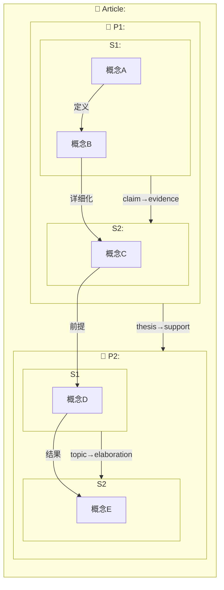

# Plan Draft — connection-reading 多层级优化

**Planner**: A(0) | **Date**: 2026-06-02 | **Requirements rounds**: 3 (ready)

---

## 1. Goal Definition

Rewrite `skills/connection-reading.md` from scratch to support three-level constraint extraction (word/sentence, sentence-to-paragraph, paragraph-to-article), backed by two new shared type files (`text-structure-types.md`, `structure-constraint-mapping.md`), with Mermaid nested-subgraph output format, mixed-mode auto-extraction, and asymmetric mode defaults — while maintaining pairing compatibility with `inquiry-essay.md`.

---

## 2. Step List

### Step 1: Create `shared/text-structure-types.md` — Structural Relationship Type Library

**Dependency type**: Sequential → Step 2, Step 3

**Description**: Design and write a new shared type taxonomy for inter-sentence and inter-paragraph relationships, parallel to `shared/constraint-types.md`. This file becomes the shared reference for both connection-reading (extraction) and future inquiry-essay (weaving) at the structural level.

**Scope — two sub-levels of structural types**:

**Level A: Sentence→Paragraph (inter-sentence relations)** — how sentences chain to form paragraph coherence. Types informed by Rhetorical Structure Theory (Mann & Thompson), FARS (Golebiowski), and academic writing pedagogy (PEEL/TEEL, Say-Mean-Matter):

| # | Type | Meaning | Example Pattern | Signal Words |
|---|------|---------|-----------------|--------------|
| 1 | **topic→elaboration** | A sentence states a claim, the next elaborates | Topic sentence → supporting detail | 具体来说、例如、这意味着 |
| 2 | **claim→evidence** | A sentence claims, the next provides evidence | Assertion → data/citation/example | 例如、数据显示、研究表明 |
| 3 | **evidence→analysis** | Evidence is followed by interpretation | Data → "this shows that..." | 这说明、由此可见、换言之 |
| 4 | **general→specific** | General statement narrowed to specific case | Broad claim → concrete instance | 特别是、以……为例、其中 |
| 5 | **specific→general** | Specific cases synthesized into generalization | Examples → overarching rule | 总的来说、综上、由此可见 |
| 6 | **cause→effect** | One sentence states cause, next states effect | Causation chain within paragraph | 因此、所以、导致、由此 |
| 7 | **effect→cause** | Effect stated first, then its cause | "This happened because..." | 原因是、因为、根源在于 |
| 8 | **contrast** | Adjacent sentences present opposing ideas | "X... However, Y..." | 然而、但是、相反、另一方面 |
| 9 | **concession** | Acknowledgment followed by counterpoint | "Although X, Y..." | 虽然、尽管、诚然……但 |
| 10 | **sequence** | Sentences form temporal or logical steps | First... Then... Finally... | 首先、接着、最后、随后 |
| 11 | **transition** | A sentence bridges to the next paragraph topic | Wrapping current + previewing next | 不仅如此、更进一步、除此之外 |
| 12 | **restatement** | Rephrasing the same idea for clarity/emphasis | "In other words..." | 换言之、即、也就是说 |

**Level B: Paragraph→Article (inter-paragraph relations)** — how paragraphs combine into the article's overall argument structure:

| # | Type | Meaning | Example Pattern | Signal Words |
|---|------|---------|-----------------|--------------|
| 13 | **thesis→support** | P1 states thesis, P2-4 provide supporting arguments | Intro paragraph → body paragraphs | N/A (structural, not lexical) |
| 14 | **problem→solution** | P1 describes problem, P2 proposes solution | Problem description → resolution | 解决方案是、对此、应对措施 |
| 15 | **question→answer** | P1 raises question, P2 answers it | "Why does X happen?" → explanation | N/A (structural) |
| 16 | **background→foreground** | P1 provides context, P2 delivers main argument | Historical/contextual → current claim | 在此背景下、基于以上认识 |
| 17 | **abstract→concrete** | P1 presents theory, P2 shows application | Principle → example/application | 例如、在实际应用中 |
| 18 | **concrete→abstract** | P1 shows example, P2 derives principle | Case study → generalization | 由此可以推断、这揭示了 |
| 19 | **claim→counterclaim** | P1 presents position, P2 presents opposing view | "Some argue X" → "Others argue Y" | 然而也有人认为、反对者指出 |
| 20 | **counterclaim→rebuttal** | P1 states opposing view, P2 refutes it | Counterargument → refutation | 但这种观点忽略了、实际上 |
| 21 | **chronological** | Paragraphs follow temporal order | Event sequence across paragraphs | 此前、此后、与此同时 |
| 22 | **comparison** | Two paragraphs compare two things side by side | "X differs from Y in that..." | 相比之下、与之类似、不同之处在于 |
| 23 | **synthesis→conclusion** | Penultimate paragraph synthesizes, final concludes | Body → synthesis → conclusion | 综上所述、因此、总而言之 |
| 24 | **digression** | A paragraph departs from main argument line | Tangential exploration → return | N/A (recognized by topic shift) |

**Additional content**:
- **Extension mechanism**: Same 4-step manual process as constraint-types.md (pause → name → define → append), but for structural types
- **Structural graph quality metrics**:
  - Coverage = structural edges / possible sentence/paragraph pairs (measures how completely the argument structure is mapped)
  - Connectivity = % of sentences/paragraphs that participate in at least one structural edge (isolated units suggest weak integration)
  - Hierarchy depth = nesting levels from article → paragraph → sentence (consistent depth suggests intentional structure)
  - Redundancy = duplicate edges of same type between same units (suggests unclear structural function)
- **Graph structure**: Nodes = {text unit reference (e.g., "P1" or "S3 of P2"), summary?}; Edges = {source→target, structural type, evidence signals?}
- **Note about future pairing**: "This type library is shared with inquiry-essay.md (writing direction) — structural types discovered during reading become available for structuring writing, and vice versa."

**Acceptance criteria**:
1. Contains 12 inter-sentence types and 12 inter-paragraph types (24 total minimum)
2. Each type has: name, meaning definition, example sentence/paragraph pattern, recognition signal words
3. Includes manual extension mechanism (4-step process)
4. Includes structural graph quality metrics (at least 3 metrics)
5. References to constraint-types.md are accurate (states separation of concerns)
6. File is valid markdown, follows shared/ file conventions
7. Follows .ai-conventions.md (offline/online not required for shared data files — they are reference documents)

**Required resources/tools**:
- Existing `shared/constraint-types.md` (for format/structure reference)
- Research: RST taxonomy (Mann & Thompson), FARS (Golebiowski), PEEL/TEEL academic writing models, Hyland's metadiscourse framework
- skill-creator:skill-creator (for writing optimization)

**Risk**: MEDIUM. The taxonomy must be comprehensive enough to cover real-world academic/argumentative texts without being so large it becomes unusable. Mitigation: Start with the 24 types listed, but design extension mechanism to handle gaps discovered during testing.

---

### Step 2: Create `shared/structure-constraint-mapping.md` — Bidirectional Mapping Layer

**Dependency type**: Sequential → Step 1 (needs structural type names) | Parallel with Step 3 ∥

**Description**: Create a bidirectional mapping file that connects structural relationships (from Step 1) to concept-level constraint types (from existing constraint-types.md). This file serves as an AI reasoning aid during analysis and defines what instance-level drill-down looks like in output.

**Content structure**:

**Section 1: Structural → Conceptual mapping (top-down)**
- For each structural type (S1–S24), list the typical concept-level constraint types that occur inside that structural relationship
- Format: `[structural type] → typically contains: [constraint type A] + [constraint type B] + ...`
- Examples:
  - `thesis→support → 详细化 + 定义 + 前提`
  - `claim→evidence → 详细化 + 是...的结果`
  - `problem→solution → 前提 + 结果`
  - `claim→counterclaim → 互斥 + 反例`
  - `contrast (sentence level) → 互斥 + 反例`
  - `synthesis→conclusion → 价值 + 结果`
- Include confidence indicators: "strong" (nearly always present), "common" (frequently present), "possible" (sometimes present)

**Section 2: Conceptual → Structural mapping (bottom-up)**
- For clusters of constraint types at sentence level, infer what structural relationship might exist at the paragraph/article level
- Format: `When sentence-level constraints [X, Y, Z] cluster across paragraph boundaries → suspect [structural type]`
- Examples:
  - `When 详细化 + 定义 cluster across same-topic paragraphs → suspect thesis→support`
  - `When 反例 + 互斥 appear at paragraph transitions → suspect claim→counterclaim`
  - `When 前提 + 结果 + 结果 chain across paragraphs → suspect problem→solution`
  - `When isolated 定义 appears in paragraph-1 position → suspect background→foreground`

**Section 3: Instance-level drill-down format**
- Define the output format for showing concept constraints nested inside structural relationships
- Example format:
  ```
  P1 → P2 [thesis→support]
    ├─ '概念A 定义 概念B' (P1:句1-2)
    ├─ '概念B 详细化 概念C' (P2:句3)
    └─ '概念C 以 概念D 为前提' (P2:句5)
  ```
- Spec: Indentation with tree-drawing characters, evidence citations traceable to original text

**Section 4: Usage protocol**
- When AI analyzes text: Use Section 1 to guide search (knowing what to look for), use Section 2 to validate findings (do the constituent constraints match the expected pattern?)
- When outputting results: Use Section 3 format for instance-level drill-down
- This file is a **reasoning aid**, not a strict rulebook — structural assignments are based on text evidence, not pattern matching alone

**Acceptance criteria**:
1. All 24 structural types from Step 1 appear in Section 1 with at least 2 constituent constraint types each
2. At least 6 entries in Section 2 (conceptual→structural inference rules)
3. Section 3 includes a clear, unambiguous output format specification with example
4. Section 4 specifies when/how the AI should use each mapping direction
5. Uses confidence levels ("strong" / "common" / "possible") for structural→conceptual entries
6. File is valid markdown

**Required resources/tools**:
- `shared/text-structure-types.md` (Step 1 output)
- `shared/constraint-types.md` (existing, for the 9 constraint types)
- skill-creator:skill-creator

**Risk**: LOW-MEDIUM. The mapping is opinionated — different text genres may have different structural→constraint patterns. Mitigation: Use confidence indicators, not absolute rules. Position the file as "reasoning aid" not "authoritative mapping."

---

### Step 3: Design Three-Level Mermaid Subgraph Output Format

**Dependency type**: Sequential → Step 1 (needs structural type labels for subgraph edge labels) | Parallel with Step 2 ∥

**Description**: Define the exact Mermaid diagram specification for the nested three-level output (article → paragraph → sentence). This step produces the template/format reference that Step 4's rewrite references when specifying output behavior.

**Design specification**:

**Mermaid syntax approach**: `flowchart TB` with nested subgraphs. Each level is a subgraph containing the next level's subgraphs. The top-level direction is TB (top-to-bottom), with inner subgraphs using independent directions for clarity.

**Full structure template**:


**Visual conventions** (Mermaid styling via `%%{init}%%` or classDef):

| Level | Node Shape | Edge Style | Color Theme |
|-------|-----------|------------|-------------|
| Article (top subgraph) | — | — | Blue border |
| Paragraph subgraph | Rounded rectangle `[]` | Thick solid lines `==>` | Green border |
| Sentence subgraph | Sharp rectangle `[]` | Solid lines `-->` | Orange border |
| Concept node | Default `[]` | Thin solid lines `-->` with constraint label | White fill |
| Cross-level edge | — | Dashed `-.->` (shows nesting) | Gray |

**Quality annotations** (inline in Mermaid as labeled notes or appended as legend):
- Isolated concept nodes: flagged with ⚠ prefix
- Contradictory edges: flagged with ⚡ prefix  
- Low-density paragraphs: subgraph border styled dashed

**Output conventions for each mode**:
- **Mode A (full annotation)**: Complete three-level subgraph, all levels populated with AI-annotated edges
- **Mode B (recall-driven, sentence-default)**: Sentence-level subgraph only (concept nodes + constraint edges), with placeholder subgraphs for paragraph/article levels shown as empty `[]` with note "optional deep-dive available"
- **Mode B (recall-driven, when user opts into deep-dive)**: Three-level subgraph, concept nodes/edges from user recall (solid), AI-suggested additions (dashed), paragraph/article edges from user recall (solid), AI-suggested (dashed)
- **Mode C (training, comprehensive)**: Progressive reveal — first show article structure (paragraph-level edges only), then paragraph structure (sentence-level edges), then concept constraints. Each level revealed after user completes corresponding training exercise.

**Mermaid limitations acknowledged and worked around**:
- No true interactivity → use static nested subgraphs; user "zooms" by reading inward
- Large articles may produce unwieldy diagrams → include rule: articles with >8 paragraphs use collapsed subgraph representations (paragraph groups) with note "expand individual paragraphs for sentence-level detail"
- Subgraph edge direction conflicts → documented in design spec: always connect at subgraph level, never to internal nodes directly

**Acceptance criteria**:
1. Mermaid code template parses correctly as valid `flowchart TB` syntax (can be copy-pasted into any Mermaid renderer)
2. Three levels are visually distinguishable in the template
3. Visual conventions table is complete (node shapes, line styles, colors for all 4 levels)
4. Per-mode output conventions specified (A full, B default, B deep-dive, C progressive)
5. Large-article handling rule documented
6. Mermaid limitation workarounds documented

**Required resources/tools**:
- `shared/text-structure-types.md` (Step 1 output) for edge labels
- Mermaid.js documentation (flowchart syntax, subgraph nesting, styling)
- skill-creator:skill-creator

**Risk**: LOW. Mermaid's subgraph capabilities are well-documented and stable. The main risk is diagram readability for large articles (mitigated by the >8 paragraph rule). The template will be tested with sample Mermaid renders during execution.

---

### Step 4: Rewrite `connection-reading.md` — Core Skill File

**Dependency type**: Sequential → Step 1, Step 2, Step 3 (needs all three foundational artifacts)

**Description**: Complete from-scratch rewrite of the main skill file. All design decisions from the requirements are implemented. The file follows .ai-conventions.md (offline/online separation, step count determined by content, no forced 5-step pattern).

**File structure** (new):

```
---
id: preserved (same slug)
slug: "connection-reading"
title: "连接导向阅读辅助"
...preserved metadata...
---

# 连接导向阅读辅助

**触发条件**: (updated for multi-level)
**核心原则**: (expanded — reading extracts structure at three levels, not just concepts)
**配对 skill**: inquiry-essay.md (still paired, note that structural types are shared too)

---

## 离线

**用户职责**: (expanded for multi-level)
1. 准备阅读材料 (unchanged)
2. 标记不确定的约束 (expanded: now includes structural relationships too)
3. 手动构建概念约束图 (expanded: now includes paragraph/article structure maps)
4. 检验图和结构的一致性 (NEW: structural graph quality metrics)
5. 跨文章比较 (unchanged)
6. 训练模式的使用 (expanded: paragraph/article structure training added)

---

## 一、共享数据层：三文件结构

> **约束关系类型库**: [shared/constraint-types.md] — 概念间约束关系（9种类型）— 词句层面
> **文本结构类型库**: [shared/text-structure-types.md] — 句间和段间结构关系（24种类型）— 句→段→篇层面
> **结构-约束映射层**: [shared/structure-constraint-mapping.md] — 双向映射，连接两个类型库
> 
> 阅读是解网（提取约束+结构），写作是织网（编码约束+结构）——三文件在两个方向共用。

---

## 在线

### 触发时机
(updated — same triggers, adds multi-level analysis triggers)

### Steps

Step 1: 模式选择与深度确认
- Mode A: 阅读辅助（全量标注，三层分析 by default）
- Mode B: 读后生成（默认句层，可选深潜到段/篇层）
- Mode C: 训练模式（默认三层，宏观→微观训练顺序）
- New: Mode B explicitly asks "是否还需要分析段落结构和文章整体架构？" after concept recall
- New: Mode C explicitly states scope "我们将从文章结构开始，逐步深入到段落内部和概念关系"

Step 2: 执行选定模式 [EXPANDED]
  - Sub-step 2A: Mode A execution — 三层分析
    1. Article-level analysis: identify paragraphs and their structural relationships
    2. Paragraph-level analysis: within each paragraph, identify inter-sentence relationships  
    3. Sentence-level analysis: within each sentence, identify concept constraints (existing behavior)
    4. Quality checks at each level
    5. Generate three-level Mermaid subgraph (per Step 3 format)
    6. Instance-level drill-down: concept constraints explicitly nested under parent structural edges
  
  - Sub-step 2B: Mode B execution — 回忆驱动（句层默认）
    1. Core concept recall (existing behavior, unchanged)
    2. Concept constraint recall (existing behavior)
    3. Generate sentence-level Mermaid subgraph
    4. NEW: Offer-to-expand prompt: "Would you also like to map the paragraph structure and article architecture? (This is optional — if the concept-level analysis is enough, we can stop here.)"
    5. IF user opts in: paragraph structure recall (user recalls how paragraphs were organized)
    6. IF user opts in: article architecture recall (user recalls overall structure)
    7. IF opted in: Generate full three-level subgraph with user-recall solid and AI-suggested dashed edges
  
  - Sub-step 2C: Mode C execution — 训练模式（三层默认，宏观→微观）
    1. Article structure training: AI shows paragraph summaries, user identifies inter-paragraph relationships → AI provides answers with rationale
    2. Paragraph structure training: per paragraph, AI shows sentence summaries, user identifies inter-sentence relationships → AI provides answers
    3. Sentence constraint training: existing behavior (per-sentence, user identifies constraint → AI answers)
    4. Statistics: correct rate per level, most-missed relationship types per level
  
  - Sub-step 2D: 混合模式自动提取 (NEW — cross-cutting, applies to all modes)
    1. During reading (silent): when AI encounters a constraint or structural relationship it cannot confidently classify into any existing shared/ type, it silently records: {text_evidence, attempted_classification, why_it_doesnt_fit}
    2. At session end (batch): AI reviews all silently-collected unclassified items
    3. Pattern detection: group similar unclassified items → draft new type proposals
    4. User review: present proposals with evidence → user approves, modifies, or rejects each
    5. If approved: AI adds new type to the appropriate shared/ file (constraint-types.md or text-structure-types.md) via manual extension mechanism
    6. Note: "新类型发现" only fires if at least 3 unclassified items were collected (avoids noise)

Step 3: 输出收尾与后续建议 (expanded)
- A/B mode: concept constraint graph recall challenge (unchanged) + NEW paragraph structure recall challenge
- C mode: per-level statistics (NEW: "你在句间关系上最常遗漏的是 [X]，在段间关系上最常遗漏的是 [Y]")
- All modes: inquiry-essay pairing reminder (expanded: "这张多层概念约束图可以直接用于写作——切换到 inquiry-essay 时可以直接使用")
- All modes: auto-extraction report if new types were proposed (summary of what was found and what was added)

---

## 补充规则

(Expanded from existing, add:)
- 文本过长（>2000 字）→ A 模式分段处理，每段标注后询问"继续下一段？"(unchanged)
- 用户说"这段我不确定"→ AI 重新逐句分析该段 (unchanged)
- 英文文本 → 约束类型名称保持中文，但例句可包含英文 (unchanged)
- 约束类型库和结构类型库是共享的——新类型同时适用于 inquiry-essay (expanded)
- Mermaid 图 >8 段时 → 使用折叠表示（段组+标注），提示用户可以展开单段查看句层
- Mode B 用户选择"不需要"深潜 → 尊重选择，不再次提示（除非用户主动说"再看看段落结构"）
- Mode C 用户在某层表现优秀（>90% 正确率）→ 可以提议跳过该层的后续训练段落，但不自动跳过
- 自动提取机制在每个 session 结束时触发一次——不在 session 中间打断用户

**Acceptance criteria**:
1. File is valid markdown with preserved metadata header
2. Contains both 离线 (offline) and 在线 (online) top-level sections
3. Three modes (A/B/C) are fully specified with expanded multi-level behavior
4. Mixed-mode auto-extraction procedure is clearly specified (silent collect + batch propose, minimum 3 items threshold)
5. Mermaid subgraph output format references Step 3 specification
6. Asymmetric defaults are correctly implemented (Mode B sentence-default with optional deep-dive prompt; Mode C all-three-levels default)
7. All three shared files are referenced in the shared data layer section
8. Pairing with inquiry-essay.md is maintained (reading extracts, writing weaves — both share constraint-types + text-structure-types)
9. Step count is determined by content need (not forced to any number)
10. Steps are checked for mergeability (no two adjacent steps that should be one)
11. No execute_skill with empty action field
12. All skill_args are valid JSON objects (empty {} where not needed)

**Required resources/tools**:
- `shared/constraint-types.md` (existing)
- `shared/text-structure-types.md` (Step 1 output)
- `shared/structure-constraint-mapping.md` (Step 2 output)
- Step 3 Mermaid output format specification
- `.ai-conventions.md` (compliance checklist)
- `inquiry-essay.md` (pairing verification reference)
- skill-creator:skill-creator (for post-write optimization)

**Risk**: HIGH. This is the most complex step — consolidating all design decisions into a single coherent skill file. Risks:
- **Bloated specification**: The file grows from ~80 lines to ~300+ lines. Mitigation: Use the shared data layer section to externalize type details (they live in shared/ files), keeping the skill file focused on operational procedure.
- **Mode interaction clarity**: Mode B's optional deep-dive path and Mode C's macro→micro progression must not create confusion. Mitigation: Use clear subsections with visual separators.
- **Regression in existing behavior**: Mode B sentence-only behavior must be preserved as the default path. Mitigation: Specify Mode B's sentence-only flow first (preserving existing behavior), then add the optional deep-dive as a clearly marked extension.

---

### Step 5: Verify Pairing Compatibility & Cross-References

**Dependency type**: Sequential → Step 4

**Description**: Verify that the rewritten connection-reading.md maintains pairing compatibility with inquiry-essay.md, all shared file references are correct, and the skill conforms to .ai-conventions.md.

**Verification checklist**:
1. **Pairing — shared data layer consistency**:
   - connection-reading.md references all three shared files (constraint-types, text-structure-types, structure-constraint-mapping)
   - inquiry-essay.md's "共享数据层" section references constraint-types.md (existing, unchanged)
   - inquiry-essay.md does NOT need to reference text-structure-types.md yet (future update, out of scope) — verify no broken expectations
   - The core pairing principle ("阅读解网，写作织网") is maintained in both files

2. **Cross-references**:
   - All `shared/` file references use correct relative paths (`shared/constraint-types.md`, `shared/text-structure-types.md`, `shared/structure-constraint-mapping.md`)
   - Reference to `inquiry-essay.md` uses correct relative path (`inquiry-essay.md`)
   - Reference to `.ai-conventions.md` if present uses correct relative path

3. **Convention compliance**:
   - Offline/online separation present ✓
   - Step count determined by content, not forced ✓
   - No mergeable adjacent steps ✓
   - action fields non-empty ✓
   - Nested skill execution (if used) has valid execute_skill ✓
   - skill_args valid JSON ✓

4. **Edge cases**:
   - What happens when a user switches from connection-reading (with extracted structure) to inquiry-essay? The concept constraint graph + structural map should be transferable. Verify the skill text supports this.
   - What happens if text-structure-types.md is extended with new types during a session? The pairing note in the file accounts for this (shared extension).
   - What happens in a no-constraint text (purely narrative/descriptive with no argument)? The skill should degrade gracefully — flag as "low constraint density" rather than fail.

**Acceptance criteria**:
1. All cross-references resolve (paths correct, files exist or are created in Steps 1-2)
2. Pairing with inquiry-essay.md is explicitly maintained in the rewritten file
3. No .ai-conventions.md violations found
4. At least 3 edge case scenarios checked and documented as handled (in supplementary rules or inline)
5. Verification report written as inline annotations or a brief summary appended to this plan file

**Required resources/tools**:
- rewritten `connection-reading.md` (Step 4 output)
- `inquiry-essay.md` (existing)
- `.ai-conventions.md` (existing)
- All three shared/ files

**Risk**: LOW. This is a verification step with clear pass/fail criteria. The main risk is discovering a requirement gap during verification that requires revisiting Step 4 — but this is exactly what verification is for.

---

## 3. Risk Identification

| Risk | Severity | Step(s) | Mitigation |
|------|----------|---------|------------|
| Structural type taxonomy incomplete | MEDIUM | 1 | 24 types seeded from RST/FARS/academic-writing research; extension mechanism handles gaps; taxonomy positioned as "starting set" not "complete set" |
| Mapping file too opinionated / genre-specific | LOW-MED | 2 | Confidence indicators (strong/common/possible); positioned as "reasoning aid" not "authoritative"; different genres may override defaults |
| Mermaid diagram unreadable for large articles | MEDIUM | 3, 4 | >8 paragraph rule collapses representations; individual paragraphs expandable; tested with real article structures during execution |
| Mode B deep-dive prompt feels intrusive | LOW | 4 | One-time prompt only; "不需要" answer respected for remainder of session; no re-prompting |
| Mode C macro→micro order overwhelming | LOW | 4 | Progressive reveal per level; user can request to skip a level if >90% correct; statistics motivate rather than discourage |
| Auto-extraction false positives (flagging too many items) | LOW-MED | 4 | Minimum 3-item threshold; silent collection prevents mid-task interruption; user approval gate for all proposals |
| File bloat (>300 lines) reduces maintainability | MEDIUM | 4 | Type details externalized to shared/ files; skill file stays focused on operational flow; shared/ files are the source of truth for types |
| Regression in existing Mode B behavior | MEDIUM | 4 | Mode B sentence-only preserved as default; deep-dive is opt-in extension; existing recall flow unchanged |
| inquiry-essay.md pairing breakage | MEDIUM | 5 | Explicit pairing section in both files; shared data layer section cross-references all three files; verification step catches any breakage |

---

## 4. AI Context Safety

**Context isolation strategy**: Each step is scoped to one file (or one sub-problem), so sub-agents executing steps work with focused context:

- **Step 1 agent**: Only needs text-structure-types.md + constraint-types.md (reference) + RST/academic-writing research. Context ~5K tokens.
- **Step 2 agent**: Only needs text-structure-types.md (Step 1 output) + constraint-types.md. Context ~5K tokens.
- **Step 3 agent**: Only needs text-structure-types.md (Step 1 output) + Mermaid documentation. Context ~4K tokens.
- **Step 4 agent**: Needs all three shared files (Steps 1-3 outputs) + existing connection-reading.md + inquiry-essay.md + .ai-conventions.md. Context ~12K tokens — the largest context, but still well within limits.
- **Step 5 agent**: Needs Step 4 output + inquiry-essay.md + .ai-conventions.md + all shared files. Context ~10K tokens.

**Cross-contamination prevention**:
- Each step's output is a standalone file (Step 1, 2, 3) or a modification of one file (Step 4)
- Step 4 reads Step 1-3 outputs but does not modify them — read-only dependency, no circular edits
- Step 5 is read-only verification, produces no file changes (only verification report)
- No two steps write to the same file (Step 4 writes connection-reading.md; Steps 1-3 each write a different shared/ file)

**Plan-level context budget**: The full plan specification (~8K tokens) + all created files (~15K tokens) + research (~5K tokens) = ~28K tokens total across all sub-agents. Each individual sub-agent operates in ~5-12K token context windows, well within safe limits.

---

## 5. Step Dependency Graph (Summary)

```
Step 1 (text-structure-types.md)
  ├──→ Step 2 (structure-constraint-mapping.md) ──┐
  │                                                ├──→ Step 4 (rewrite connection-reading.md) ──→ Step 5 (verify)
  └──→ Step 3 (Mermaid output format) ─────────────┘
```

Steps 2 and 3 run in parallel after Step 1 completes. Step 4 requires all three. Step 5 is final verification.

**Estimated total execution time**: 4-6 hours (Step 1: 1-1.5h, Step 2: 0.5-1h, Step 3: 0.5-1h, Step 4: 1.5-2h, Step 5: 0.5h)

---

## End of Plan Draft

Submitted for B(0) review. If REJECTED, A(0) will address every review item in this file and resubmit.
