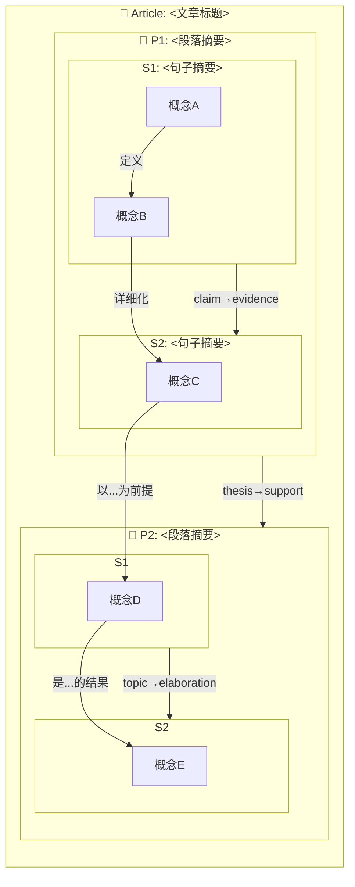
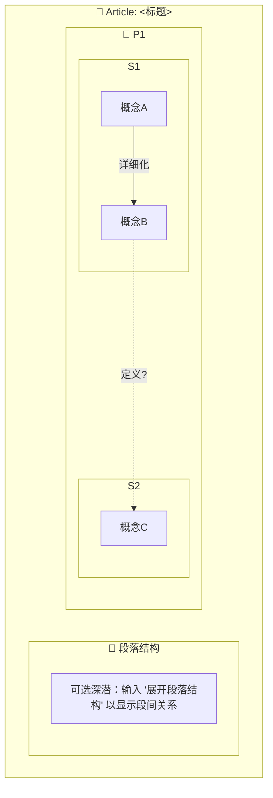
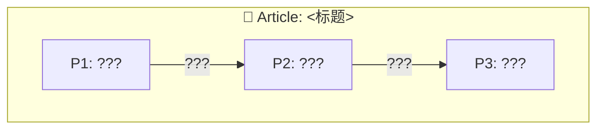
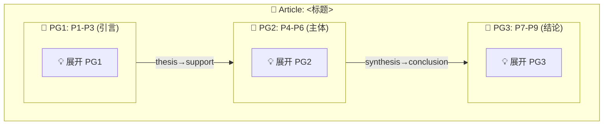

# 三层 Mermaid 子图输出格式规范

> 供 [connection-reading.md](../connection-reading.md) 引用。定义嵌套三层 Mermaid 子图（篇章→段落→句子）的输出模板、视觉约定和各模式下的行为差异。

---

## 一、Mermaid 语法方案

使用 `flowchart TB`（top-to-bottom）作为顶层方向，各层子图内部使用独立方向以保证视觉清晰。

### 完整模板



### 语法规则

1. **顶层**：`flowchart TB`，用 `Article` 子图包裹全部内容
2. **段层子图**：`subgraph P<编号>["📑 P<编号>: <段落摘要>"]`，内部 `direction LR`
3. **句层子图**：`subgraph P<编号>S<编号>["S<编号>: <句子摘要>"]`，无内部方向声明（继承段层方向）
4. **概念节点**：`<概念别名>[<概念名称>]`，概念别名使用大写字母（A-Z）或简短标识符
5. **概念约束边**：`<源> -->|"<约束类型>"| <目标>`，约束类型使用 constraint-types.md 中的中文名称
6. **句间结构边**：`P<段>S<句> -->|"<语义角色对>"| P<段>S<句>`，语义角色对使用 text-structure-types.md 中的英文/符号名称（旧标签保留为速记）
7. **段间结构边**：`P<段> -->|"<语义变体>"| P<段>`，语义变体使用 text-structure-types.md 中的段间 topic→elaboration 语义变体名称

---

## 二、视觉约定

### 样式表

通过 Mermaid `%%{init}%%` 配置或 `classDef` 实现：

| 层级 | 节点形状 | 边样式 | 颜色主题 | 用途 |
|------|---------|--------|---------|------|
| Article（顶层子图） | 圆角矩形 | — | 蓝色边框 `#4A90D9` | 包裹整体，提供文章标题 |
| Paragraph（段子图） | 圆角矩形 `[ ]` | 粗实线 `==>` | 绿色边框 `#5B9A5B` | 段落级结构容器 |
| Sentence（句子图） | 直角矩形 `[ ]` | 实线 `-->` | 橙色边框 `#E8943A` | 句子级结构容器 |
| Concept（概念节点） | 默认 `[ ]` | 细实线 `-->` + 约束标签 | 白色填充 `#FFFFFF` | 概念及概念间约束关系 |
| 跨层嵌套边 | — | 虚线 `-.->` | 灰色 `#AAAAAA` | 表示层级间的包含关系 |

### classDef 实现参考

```
classDef article fill:#F0F7FF,stroke:#4A90D9,stroke-width:3px
classDef paragraph fill:#F5FFF0,stroke:#5B9A5B,stroke-width:2px
classDef sentence fill:#FFF8F0,stroke:#E8943A,stroke-width:1.5px
classDef concept fill:#FFFFFF,stroke:#666666,stroke-width:1px
```

### 质量标注

在 Mermaid 图中以外挂注释或样式标记形式标注质量问题：

| 质量问题 | Mermaid 标记方式 | 说明 |
|---------|-----------------|------|
| 孤立概念节点 | 节点名前缀 `⚠` （如 `⚠A[概念A]`） | 该概念未被任何约束边关联 |
| 矛盾约束边 | 边标签后追加 `⚡` （如 `-->|"互斥 ⚡"|`） | 该边与图中另一条边构成逻辑矛盾 |
| 低密度段落 | 子图边框样式设为 `stroke-dasharray: 5 5` | 该段落内概念约束边数显著低于平均水平 |

---

## 三、按模式的输出约定

### Mode A：阅读辅助（全量标注，默认三层）

**输出内容**：完整三层 Mermaid 子图
- 段间结构边：AI 分析标注
- 句间结构边：AI 分析标注
- 概念约束边：AI 分析标注
- 所有边均为实线，表示 AI 的确定输出

**生成顺序**：
1. 先生成概念节点（所有句子中识别出的概念）
2. 再生成概念约束边（句内+跨句）
3. 再生成句间结构边
4. 最后生成段间结构边

**特殊规则**：
- 无约束句子标注：`subgraph PnSm["⚠ Sm: [无约束]"]`（虚边框）
- 超长文本（>8 段）：扩展见第四节

---

### Mode B：回忆驱动（默认句层，可选深潜）

#### Mode B 默认（句层 only）

**输出内容**：仅句子层 Mermaid 子图
- 概念节点：用户回忆的概念
- 概念约束边：实线 = 用户回忆的约束，虚线 = AI 建议后用户确认的约束
- 段/篇子图以占位符展示：



**虚线约定**：
- `-...->|"约束类型?"|`：AI 建议但用户尚未确认的边（Mermaid 不支持直接虚线，使用边缘注释 `?` 标记代替）

#### Mode B 深潜（用户 opt-in 后）

**输出内容**：完整三层 Mermaid 子图
- 段间/句间结构边：实线 = 用户回忆的结构，虚线 = AI 建议的补充
- 概念约束边保持 Mode B 默认状态（实线=回忆，虚线=AI建议）
- 段/篇子图以完整形式展开

---

### Mode C：训练模式（三层默认，渐进揭示）

**Phase 1 — 文章结构层**：仅展示段落级结构

用户填写后 → AI 揭示正确答案（边标签填入，段落摘要填入）

**Phase 2 — 段落结构层**：展开选中段落的句间结构
用户完成 Phase 1 后 → AI 选择一段展开为句间结构（`???`占位）→ 用户填写 → AI 揭示

**Phase 3 — 概念约束层**：展开选中句子的概念约束
用户完成 Phase 2 后 → AI 选择一句展开为概念约束（`???`占位）→ 用户填写 → AI 揭示

**渐进规则**：
- 每个阶段用户独立完成，不提前看到下一层的答案
- 三阶段全部完成后，AI 生成完整三层子图（无占位符）供用户对比
- 统计正确率标注在每个层级的标题旁

---

## 四、大文本处理规则

当文章段落数 > 8：

1. **段组折叠**：将连续 2-3 段合并为一个段组子图（`subgraph PG1["📑 P1-P3"]`），段组内不展开句层
2. **展开提示**：在折叠段组旁标注 `💡 输入 '展开 PG1' 以查看 P1-P3 的句层细节`
3. **段间结构边保持**：即使段组折叠，段组之间的结构边仍正常显示
4. **按需加载**：用户请求展开某个段组时，AI 生成该段组的完整句层子图（作为独立的 Mermaid 代码块追加）

### 示例（9段文章折叠为3个段组）



---

## 五、Mermaid 限制与变通方案

| 限制 | 影响 | 变通方案 |
|------|------|---------|
| 不支持真正的交互性（点击/折叠） | 用户无法在图中直接展开/收起层级 | 使用静态嵌套子图 + 外挂提示文字；用户通过对话请求展开，AI 生成新的独立代码块 |
| 子图内不允许 `direction` 与边声明冲突 | 复杂布局可能不按预期排列 | 始终在子图级别连接（`P1S1 --> P1S2`），不在子图与内部节点间混连；需要跨层引用时使用虚线 |
| 无虚线边样式原生支持 | 无法在 Mermaid 原生语法中区分实线/虚线 | 使用边标签后缀 `?` 标记不确定的边；若 Mermaid 版本支持 `linkStyle`，可附加样式声明 |
| 大图渲染性能 | 超过 ~50 个节点的图可能渲染缓慢 | 默认使用段组折叠（第四节）；对超大文本（>15段）改用分段输出（每段独立子图） |
| 中文字符在部分渲染器中显示异常 | 约束类型名称可能出现乱码 | 所有中文字符使用双引号包裹（Mermaid 规范）；必要时提供英文缩写对照 |
| 子图样式不能通过 classDef 直接控制 | 段落/句子子图的边框颜色需额外处理 | 使用 `style` 指令单独控制每个子图的样式；或接受默认渲染，通过命名前缀（📑🟢/🟠）辅助区分 |
